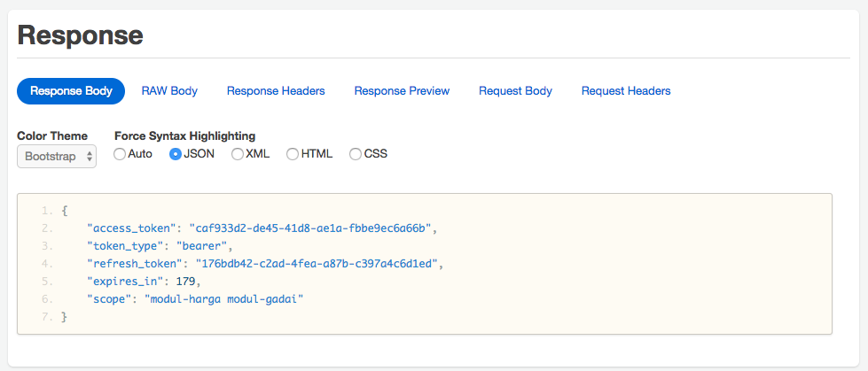

# Implementasi OAuth 2 dengan Spring #

Konsep OAuth 2


Flow Grant Type Authorization Code


Flow Grant Type Implicit


Flow Grant Type Password


Flow Grant Type Device


## Authorization Server ##

Endpoints :

### Otorisasi / Mendapatkan Token ###

URL : [http://localhost:10000/oauth/authorize?client_id=aplikasiweb&response_type=code&redirect_uri=http://example.com](http://localhost:10000/oauth/authorize?client_id=aplikasiweb&response_type=code&redirect_uri=http://example.com)


### Menukar access code dengan access token ###

URL : http://localhost:10000/oauth/token


### Mengecek validitas dan informasi token ###

URL : http://localhost:10000/oauth/check_token


* Refresh Token

URL : http://localhost:10000/oauth/token





### Enable JWT ##

Generate dulu keypair yang tersimpan dalam keystore. Bisa dengan interaktif seperti ini


Bisa juga dengan satu kali perintah seperti ini

```
keytool -genkeypair -alias jwt -keyalg RSA -dname "CN=Aplikasi Gadai, OU=Divisi Training, O=ArtiVisi, L=Jakarta, ST=Jakarta, C=ID" -keypass gadai123 -keystore src/main/resources/jwt.jks -storepass gadai123
```
